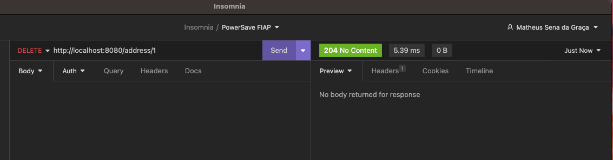

# TECH CHALLENGE PÓS FIAP - POWER SAVE APIs

## Descrição do Projeto

Este repositório contém o código-fonte do Tech Challenge I do programa de pós-graduação FIAP + Alura. A iniciativa foi concebida para avaliar as competências de programação adquiridas durante o primeiro módulo do programa. O projeto consiste em desenvolver três APIs com responsabilidades bem definidas, destinadas a serem consumidas por um portal web para apresentar aos usuários dados detalhados sobre o consumo de energia de seus eletrodomésticos.

Essas APIs foram projetadas segundo o princípio de responsabilidade única e foram implementadas utilizando a linguagem de programação Java, juntamente com o Spring Framework. Além disso, utilizamos a biblioteca Lombok para reduzir a verbosidade do código Java e o H2 como nosso banco de dados em memória.

## Tecnologias Utilizadas

- **Java - Versão 17**: Linguagem de programação de alto nível usada para desenvolver uma variedade de aplicações, desde aplicações web até aplicativos móveis.

- **Spring Framework**: Fornece um modelo de programação e configuração abrangente para aplicativos empresariais modernos baseados em Java.

- **Lombok**: Biblioteca Java que automatiza a criação de métodos como getters, setters, constructors, melhorando a legibilidade do código.

- **H2 Database**: Um banco de dados em memória escrito em Java, rápido e adequado para aplicativos de teste e desenvolvimento.

## APIs Desenvolvidas

- **AddressController**: Gerencia todas as operações CRUD relacionadas a endereços.

> Post: Save address object to database
>> http://localhost:8080/v1/address

> Get : Get all address from database
>> http://localhost:8080/v1/address

> Get By Id : Get address by ID from database
>> http://localhost:8080/v1/address/{id}

> Put : Put address object by ID to database
>> http://localhost:8080/v1/address/{id}

> Delete : Delete address object by ID to database
>> http://localhost:8080/v1/address/{id}

- **PersonController**: Gerencia todas as operações CRUD relacionadas a pessoas.

> Post: Save people object to database
>> http://localhost:8080/v1/people

> Get : Get all people from database
>> http://localhost:8080/v1/people

> Get By Id : Get people by ID from database
>> http://localhost:8080/v1/people/{id}

> Put : Put people object by ID to database
>> http://localhost:8080/v1/people/{id}

> Delete : Delete people object by ID to database
>> http://localhost:8080/v1/people/{id}

- **ApplianceController**: Gerencia todas as operações CRUD relacionadas a aparelhos domésticos.

> Post: Save appliance object to database
>> http://localhost:8080/v1/appliance

> Get : Get all appliance from database
>> http://localhost:8080/v1/appliance

> Get By Id : Get appliance by ID from database
>> http://localhost:8080/v1/appliance/{id}

> Put : Put appliance object by ID to database
>> http://localhost:8080/v1/appliance/{id}

> Delete : Delete appliance object by ID to database
>> http://localhost:8080/v1/appliance/{id}

## Arquitetura do Projeto

Este projeto segue os princípios da Arquitetura em Camadas, subdividindo-se em Controllers, Services, Entities, Repositories, Records e DTOs. Essa estrutura capitaliza vários benefícios estratégicos discutidos durante o 1º módulo do programa de pós-graduação. Os benefícios notáveis incluem:

- **Separação de Responsabilidades**: Cada camada possui uma responsabilidade única, cumprindo o princípio de responsabilidade única do SOLID.

- **Reutilização de Código**: A modularidade promove a identificação e o isolamento eficazes de componentes reutilizáveis.

- **Manutenção Simplificada**: A manutenção é facilitada pela divisão de responsabilidades, permitindo a isolamento de alterações a uma camada específica.

- **Escalabilidade Aprimorada**: A estrutura em camadas facilita a escalabilidade granular, permitindo que componentes individuais sejam escalados conforme a demanda.

Utilizamos DTOs (Data Transfer Objects) para melhorar a segurança dos dados, aderir à separação de responsabilidades e minimizar o tráfego de rede. Além disso, adotamos o uso de registros (Java Records) para criar classes de dados imutáveis de maneira mais concisa e segura.

## Execução do Projeto

1. Clone este repositório para o seu ambiente de desenvolvimento.
2. Abra o projeto na sua IDE que suporte desenvolvimento Java (por exemplo, IntelliJ IDEA, Eclipse).
3. Execute o projeto - o servidor será iniciado automaticamente.
> Nota: Certifique-se de ter o ambiente Java e todas as outras dependências instaladas.

## Outros links
Ao executar o projeto, o Swagger poderá ser acessado em:
>http://localhost:8080/swagger-ui/index.html

Caso prefira executar as API's via Insomnia, a collection está disponível em:

> [Tech Challenge API](./documentation/PowerSave-Insomnia.json)

## Contribuição
Sinta-se à vontade para contribuir para este projeto. Para problemas, solicitações de recursos ou correções de bugs, abra uma issue no GitHub.

## Licença
Este projeto está licenciado sob a licença MIT.

## Contato
Desenvolvido por:

- Diego Valente - RM 348497
- Matheus Sena - RM 430025
- William Kaminski - RM 430025

