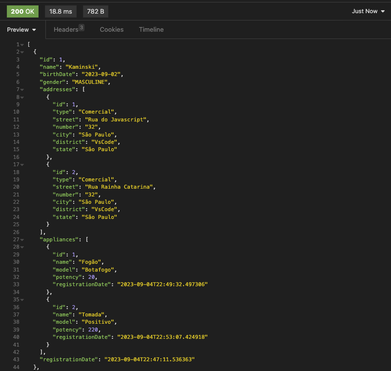

# TECH CHALLENGE PÓS FIAP - POWER SAVE APIs

## Descrição do Projeto

Este repositório contém o código-fonte do Tech Challenge II do programa de pós-graduação FIAP + Alura. A iniciativa foi concebida para avaliar as competências de programação adquiridas durante o primeiro módulo do programa. O projeto consiste em desenvolver três APIs com responsabilidades bem definidas, destinadas a serem consumidas por um portal web para apresentar aos usuários dados detalhados sobre o consumo de energia de seus eletrodomésticos.

Essas APIs foram projetadas segundo o princípio de responsabilidade única e foram implementadas utilizando a linguagem de programação Java, juntamente com o Spring Framework. Além disso, utilizamos a biblioteca Lombok para reduzir a verbosidade do código Java e o MySQL com Docker para a base de dados.

Nessa entrega, também criamos os relacionamentos entre as unidades Appliance, Address e Person, o mesmo será descrito abaixo

## Tecnologias Utilizadas

- **Java - Versão 17**: Linguagem de programação de alto nível usada para desenvolver uma variedade de aplicações, desde aplicações web até aplicativos móveis.

- **Spring Framework**: Fornece um modelo de programação e configuração abrangente para aplicativos empresariais modernos baseados em Java.

- **Lombok**: Biblioteca Java que automatiza a criação de métodos como getters, setters, constructors, melhorando a legibilidade do código.

- **MySQL**: Plataforma que facilita a criação, o envio e a execução de aplicativos em contêineres, garantindo que o software funcione da mesma forma, independentemente de onde e como é implantado.

- **Docker**: Um dos sistemas de gerenciamento de banco de dados mais populares, baseado em SQL (Structured Query Language). É usado para armazenar, organizar e recuperar dados.


## Sobre o Relacionamento:

O principal desafio desse Tech Challenge foi a criação dos relacionamentos entre as entidades utilizadas no projeto
A representação está descrita na imagem abaixo:


### Entidades e Relações
**Person - Address**:

- Uma pessoa pode ter vários endereços, e um endereço pode pertencer a várias pessoas.

- Tipo de Relação: N:N (muitos para muitos).

- Implementação: Utilização da tabela intermediária tb_person_address com chaves estrangeiras para Pessoa e Endereço.


**Person - Appliance**:

- Descrição: Uma pessoa pode usar vários eletrodomésticos e um eletrodoméstico pode ser usado por várias pessoas.

- Tipo de Relação: N:N (muitos para muitos).

- Implementação: Utilização da tabela intermediária tb_person_appliance com chaves estrangeiras para Pessoa e Eletrodomestico.


**Address - Appliance**:

- Descrição: Um endereço pode ter vários eletrodomésticos, mas um eletrodoméstico está associado a apenas um endereço.

- Tipo de Relação: 1:N (um para muitos).

- Implementação: A tabela Eletrodomestico terá uma chave estrangeira para o Endereço.

**Person - Kinship**:

- Descrição: Uma pessoa pode ter vários parentescos, representados pela entidade Kinship. 
O campo kinshipsAsPerson na classe Person refere-se à pessoa principal em um relacionamento de parentesco.
Também uma pessoa pode ser um parente (ou seja, a outra pessoa) em vários relacionamentos de parentesco. 
O campo kinshipsAsKinshipPerson na classe Person refere-se à pessoa que tem um relacionamento de parentesco específico com a pessoa principal.

- Tipo de Relação: 1:N (um para muitos).

- Implementação: Chave Estrangeira em Kinship: person_id e Chave Estrangeira em Kinship: kinship_person_id

## Tabelas Resultantes


- **tb_person**: Armazena informações sobre indivíduos.
- **tb_address**: Armazena informaçinformações sobre localizações.
- **tb_appliance**: Armazena informações sobre aparelhos, como geladeiras, fogões e afins.
- **tb_kinship**: Armazena informações sobre os relacionamentos de parentesco entre as pessoas. Esta tabela contém duas chaves estrangeiras referenciando a tabela Pessoa — uma representando a pessoa principal (person_id) e outra representando o parente (kinship_person_id)
- **tb_person_address**: Tabela de junção que representa a relação N:N entre Pessoa e Endereço.
- **tb_person_appliance**: Tabela de junção que representa a relação N:N entre Pessoa e Eletrodomestico.

## APIs Desenvolvidas

- **AddressController**: Gerencia todas as operações CRUD relacionadas a endereços.

> Post: Save address object to database
>> http://localhost:8080/v1/address


> Get : Get all address from database
>> http://localhost:8080/v1/address


> Get By Id : Get address by ID from database
>> http://localhost:8080/v1/address/{id}


> Put : Put address object by ID to database
>> http://localhost:8080/v1/address/{id}


> Delete : Delete address object by ID to database
>> http://localhost:8080/v1/address/{id}


- **PersonController**: Gerencia todas as operações CRUD relacionadas a pessoas.

> Post: Save person object to database
>> http://localhost:8080/v1/people


> Get : Get all person from database
>> http://localhost:8080/v1/people


> Get By Id : Get person by ID from database
>> http://localhost:8080/v1/people/{id}


> Put : Put person object by ID to database
>> http://localhost:8080/v1/people/{id}


> Delete : Delete person object by ID to database
>> http://localhost:8080/v1/people/{id}


-**Novos endpoints criados**:

> Post: Associate a address to a person
>> http://localhost:8080/v1/people/{PersonId}/associate-address/{AddressID}

> Post: Associate a appliance to a person
>> http://localhost:8080/v1/people/{PersonId}/associate-appliance/{ApplianceId}

- **ApplianceController**: Gerencia todas as operações CRUD relacionadas a aparelhos domésticos.

> Post: Save appliance object to database
>> http://localhost:8080/v1/appliance


> Get : Get all appliance from database
>> http://localhost:8080/v1/appliance


> Get By Id : Get appliance by ID from database
>> http://localhost:8080/v1/appliance/{id}


> Put : Put appliance object by ID to database
>> http://localhost:8080/v1/appliance/{id}


> Delete : Delete appliance object by ID to database
>> http://localhost:8080/v1/appliance/{id}


Após a criação dos endpoints que fazem a associação dos endereços e eletrodométicos, agora é possível visualizar as associações nos metódos GET

## Arquitetura do Projeto

Este projeto segue os princípios da Arquitetura em Camadas, subdividindo-se em Controllers, Services, Entities, Repositories, Records e DTOs. Essa estrutura capitaliza vários benefícios estratégicos discutidos durante o 1º módulo do programa de pós-graduação. Os benefícios notáveis incluem:

- **Separação de Responsabilidades**: Cada camada possui uma responsabilidade única, cumprindo o princípio de responsabilidade única do SOLID.

- **Reutilização de Código**: A modularidade promove a identificação e o isolamento eficazes de componentes reutilizáveis.

- **Manutenção Simplificada**: A manutenção é facilitada pela divisão de responsabilidades, permitindo a isolamento de alterações a uma camada específica.

- **Escalabilidade Aprimorada**: A estrutura em camadas facilita a escalabilidade granular, permitindo que componentes individuais sejam escalados conforme a demanda.

Utilizamos DTOs (Data Transfer Objects) para melhorar a segurança dos dados, aderir à separação de responsabilidades e minimizar o tráfego de rede. Além disso, adotamos o uso de registros (Java Records) para criar classes de dados imutáveis de maneira mais concisa e segura.

## Execução do Projeto

### Preparativos

1. **Certifique-se de que o Docker esteja instalado** em sua máquina.
2. **Clone este repositório** para o seu ambiente de desenvolvimento.

### Configuração do Ambiente

1. Abra o projeto na sua IDE de preferência que suporte desenvolvimento Java, como IntelliJ IDEA ou Eclipse.

### Inicialização do MySQL via Docker

1. Inicie o Docker Daemon em sua máquina.
2. No terminal ou prompt de comando, navegue até a pasta raiz do projeto e execute o seguinte comando:

```bash
docker-compose up -d
```

Nota: A opção -d fará com que os containers rodem em background.

3. Execute o projeto - o servidor será iniciado automaticamente.
Certifique-se de ter o ambiente Java e todas as outras dependências instaladas.

## Outros links
Ao executar o projeto, o Swagger poderá ser acessado em:
>http://localhost:8080/swagger-ui/index.html

Caso prefira executar as API's via Postman, a collection está disponível em:

> [Tech Challenge API](./documentation/PowerSave FIAP.postman_collection.json)

## Contribuição
Sinta-se à vontade para contribuir para este projeto. Para problemas, solicitações de recursos ou correções de bugs, abra uma issue no GitHub.

## Licença
Este projeto está licenciado sob a licença MIT.

## Contato
Desenvolvido por:

- Diogo Valente - RM 348497
- Matheus Sena - RM 430025
- Willian Kaminski - RM 430025


